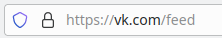
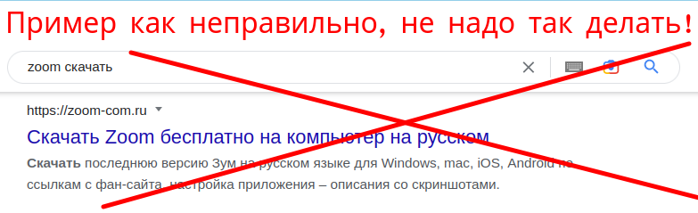
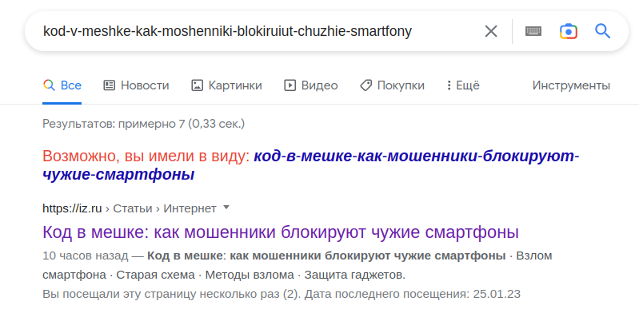
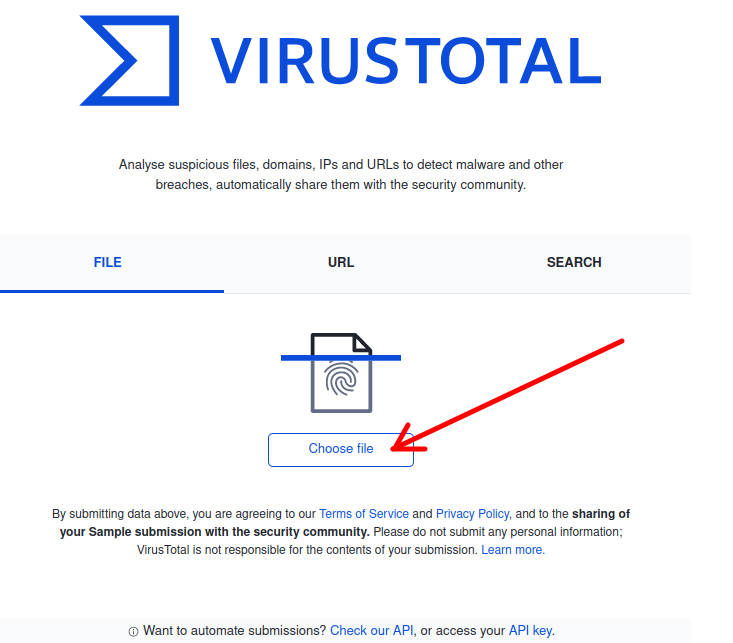
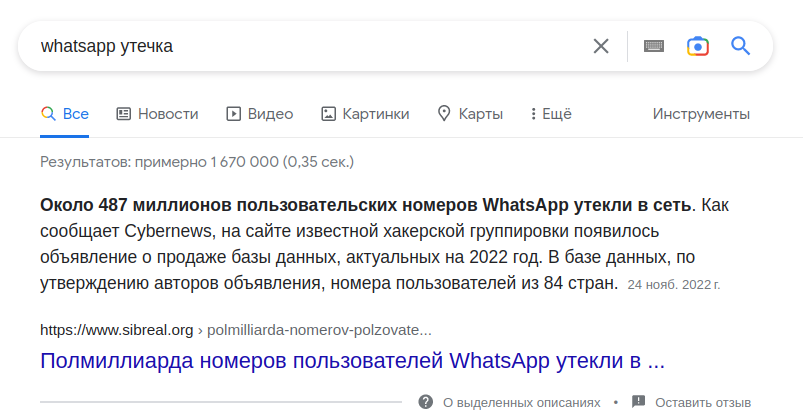
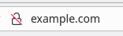
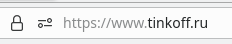
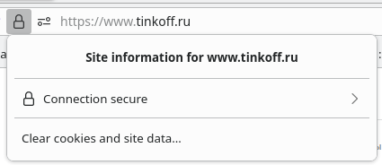

# Основы бытовой кибер-безопасности, коротко, без воды
* Этот текст написан так, чтобы его мог прочитать любой человек, не имеющий отношения к IT
* Поэтому здесь не будет технических деталей про виды уязвимостей программ, а будет только информация с бытовой и пользовательской точки зрения 
* Дисклеймеры для айтишника
  * Некоторые вещи покажутся IT-шнику недостаточно точными и слишком "юзерскими"
  * Но цель этого текста не пройти IT-собеседование, а максимально коротко и понятно донести материал для людей, не связанных с IT
  * И да, я знаю что вы любите Linux, я его тоже люблю, но здесь рассказ будет с точки зрения Windows по причинам, указанным выше

# Совсем коротко - если нет времени читать всё, запомните хотя бы эти правила
* **Самое важное - это образ мышления**: 
  * Нет единого способа обезопаситься просто и быстро. Хочется или нет, но придётся останавливаться и задумываться о том, насколько безопасны те или иные действия (переходы по ссылкам, ввод паролей, установка программ и т.д.).
  * Правила ниже не включают себя защиту от всех возможных видов хакерства, и они будут постоянно появляться новые. Поэтому самая главная защита - это образ мышления.
  * ПРостое описание этого образа мышления: ВКЛЮЧИТЕ В СЕБЕ КГБ-ШНИКА И НЕ ДОВЕРЯЙТЕ В ИНТЕРНЕТЕ НИКОМУ, НИЧЕМУ И НИКОГДА, ПОДОЗРЕВАЙТЕ ВСЕГДА, ВСЁ И ВЕЗДЕ!
* **Не вводите пароль / одноразовый код где попало**
  * Если где-то просят ввести, и это новое место, где вы раньше не вводили - 100 раз подумать а не хакеры ли это
  * Даже если место где вы вводите пароль (сайт или приложение) выглядит как официальное - всё равно не торопитесь вводить, хакеры как правило как раз маскируют свои хакерские штуки под официальные сайты
* **Придумывайте сложные пароли**
  * Пароли вида "111111", "qwerty", "password", дата рождения и прочие такие - **это плохо, не делайте так**, они очень легко угадываются
  * Пароли с изменением раскладки, например "wdtnjxtr" (слово цветочек, набранное когда клавиатура на английской раскладке) - **тоже плохо, они тоже угадываются**
  * Современные сервисы подсказывают вам насколько хороший пароль вы придумали, не игнорируйте эти подсказки
  * Если таких подсказок нет, просто вбейте в поиске "как придумать хороший пароль" - в статьях много воды, но это надо один раз прочитать
* **Не игнорируйте сервисные сообщения от сервисов "кто-то вошёл в ваш аккаунт" или "попытка входа в ваш аккаунт"**
  * Часто люди забивают на эти сообщения, а зря
  * Если вы получили такое, и точно знаете что это не вы, срочно реагируйте и поднимайте тревогу!
* **Всегда используйте двухфакторную аутентификацию**
  * Это когда для входа в аккаунт надо ввести не только пароль, но и одноразовый код, отправленый на телефон или ещё куда-то
  * Для каждого конкретного сервиса поищите в яндексе/гугле как там настроить двухфакторную аутентификацию
* **Не переходите по ссылкам на незнакомые сайты и возьмите за правило всегда внимательно смотреть на ссылку перед перходом по ней**
  * Рассмотрим ссылку ``https://4jjgh578k.net.ru/profile/s4ff&p1=44&p2=aaa`` 
  * ``4jjgh578k.net.ru`` в данном примере - это адрес сайта (всё что между ``://`` и следующим ``/``)
  * Вы не знаете этот адрес, и он вообще странный - значит не стоит на него идти
  * **Очень важно**: обращать внимание на "опечатки" в ссылках, например вам могут по почте прислать ссылку ``https://wk.com/feed`` - она похожа на вконтакте ``https://vk.com/feed``, но это **другой сайт, не надо туда ходить!**
  * Но вы же не можете знать наизусть все сайты? Что делать если есть нормальная ссылка, но вы не знаете этот сайт, например ``https://iz.ru/1459404/mariia-frolova/kod-v-meshke-kak-moshenniki-blokiruiut-chuzhie-smartfony``? Об этом - см. ниже в разделе "Важные лайфхаки"
* **Обращайте внимание на знак замочка у адреса сайта в браузере**
  * 
  * Если он перечёркнут - значит нельзя на такой сайт передавать ценную информацию, вводить пароли, ничего оттуда скачивать и вообще лучше уходите оттуда
* **Устанавливайте программы на компьютер или гаджет только из официальных источников**
  * Например, вам надо установить Zoom - программу для видеосвязи с другими людьми
  * Как правильно: скачать с официального сайта ``https://zoom.us``
  * Как неправильно: скачать с непонятно какого сайта, например какой-то ``https://zoom-com.ru`` 
  * 
  * А как найти официальный сайт какой-нибудь программы? Об этом ниже в разделе "Важные лайфхаки"
* **Регулярно сохраняйте свои наиболее ценные файлы на внешний физический диск или флешку**
  * В случае подхвата серьёзного вируса, придётся перестанавливать всю систему на вашем компьютере с потерей всех данных
  * Да и сам вирус может испортить ваши файлы
  * В интернете некоторые наиболее важные личные данные хранить нельзя, потому что с любым сервисом тоже может быть утечка
  * Если есть время и силы, посмотрите ниже в advanced раздел, там рассказано как ещё и зашифровать диск, чтобы в случае его утери защитить персональные данные

# Важные лайфхаки
### Как понять, безопасная ли ссылка на незнакомый сайт
* Например, вам незнаком сайт ``iz.ru``
* Например, есть ссылка ``https://iz.ru/1459404/mariia-frolova/kod-v-meshke-kak-moshenniki-blokiruiut-chuzhie-smartfony``
* Можно вбить эту ссылку в virustotal.com и проверить её (если конечно сама эта ссылка не является приватной информацией). Подробнее о virustotal ниже.
* Либо ещё можно вбить часть этой ссылки в поиск google/yandex (опять же если сама эта ссылка не является приватной информацией)
* 
* Видим что google на первом месте выдал ссылку на iz.ru
* Можно перейти, но **лучше это сделать из выдачи поиска, а не по самой исходной ссылке**
* Заодно на странице поиска вы увидите заголовок и частично содержание страницы до перехода на неё, и сможете лучше понять что там внутри
* Это чаще всего работает, потому что поисковики обычно проверяют на вирусы сайты, которые они ставят на топовые места в выдаче. Если сайт подозрительный, поисковик рядом напишет, что этот сайт может содержать угрозы. Обращайте внимание на такие надписи
* **Важно**: это НЕ работает, если явно понятно что это ссылка на стрёмный ресурс - например порносайт. Поэтому перед переходом по ссылке, **прочитайте что написано по этому сайту на сстранице выдачи поиска**.
* И если это порносайт, или какой-то другой стрёмный сайт вида "заработай млн долларов на биткоине прямо сейчас" - тогда **даже переход с 1-го места из поиска может быть опасен** - вы будете делать это на свой страх и риск.
* Если сайт в выдаче довольно низко, например, ниже 5-го места - тут уже надо задуматься, такая ссылка тоже может быть опасна

### Как найти официальный сайт программы
* Например, мы хотим скачать Zoom - программу для видеосвязи - и не знаем официальный сайт, откуда её скачать
* Способы, описанные ниже **не гарантируют безопасность**, но как правило работают, и дают больше вероятности уберечься от вирусов
* Для начала можно просто вбить в поисковике что-то вроде "zoom официальный сайт" и на первом же месте он выдаст нужную ссылку
* Также можно найти статью про Zoom на википедии ``https://ru.wikipedia.org`` (у википедии есть окно поиска)
* В статьях википедии о разных программах как правило есть ссылка на официальный сайт
* Однако надо помнить, что в теории хакеры могут подменить официальную ссылку на свою как в википедии, так и обмануть поиск и сделать так, чтобы поиск выдавал хакерскую ссылку по запросу "официальный сайт"

### Проверить файл на вирусы сразу всеми антивирусами
* Есть такой сайт https://www.virustotal.com
* Туда можно загрузить файл с диска, и он проверит его на вирусы большим количеством разных антивирусов
* 
* Нельзя туда загружать файлы, если там есть ваша приватная информация - потому что вы отдаёте эту информацию в интернет по сути
* Там есть ограничение на размер - не более 650 Мб
* Также обратите внимание на вкладку URL выше - там можно проверить на вирусы также ссылку на сайт в интернете 

### Авто-удаление сообщений в мессенджерах
* В некоторых мессенджерах, например telegram, есть возможность настроить автоматическое удаление сообщений через какое-то время
* Это полезно чтобы в случае взлома вся история вашей переписки не утекла 

### Секретные чаты в телеграм
* В telegram есть такое понятие "секретный чат" - забейте в поиске как этим пользоваться
* Суть этого в том, что сообщения в таком чате остаются только на ваших устройствах, и не хранятся внутри телеграма, поэтому в случае взлома аккаунта эти сообщения не утекут
* Из этого следует, что вы не сможете видеть сообщения секретного чата на других ваших устройствах, а только на том, где вы создали этот секретный чат

# Объекты хакерских атак - что пытаются взломать хакеры
* Аккаунты в ваших соцсетях, мессенджерах и прочих сервисах, таких как например госуслуги
* Ваш браузер (программа для работы в интернете, например Chrome, Firefox, Safari)
* Ваш компьютер или гаджет

# Цели хакерских атак - для чего пытаются взломать хакеры
* Рассылка спама или вирусов от вашего имени
* Скрытое использование вашего компьютера или аккаунта в преступных целях
* Сломать ваш компьютер или гаджет и потом требовать деньги за восстановление
* Похищение вашей персональной информации, например банковских карт и кодов к ним, чтобы воровать деньги
* Отслеживание вашей деятельности - на какие сайты вы ходите, что вообще делаете за компьютером и т.д.

# Виды хакерских атак - как пытаются взломать хакеры, и как от этого защититься
### Фишинг или социальная инженерия
* Суть хакерства в том, чтобы заставить вас обманным путём добровольно слить свои логины-пароли-коды проверки
* Вам где-то присылают ссылку, которая выглядит безобидно, и при переходе на неё вы попадаете на сайт, который очень похож на сайт какого нибудь настоящего сбера, вконтакта и т.д.
* Там вас просят ввести коды-пароли, и вы, думая что это официальный сервис просит вас это сделать, вводите эти коды, после чего хакер получает полный доступ к вашему аккаунту
* Также часто хакеры давят на "срочность" - присылают вам письмо или сообщение, которое нарушает вашу эмоциональную стабильность, например:
  * "это мама я попала в крупную аварию, пишу с чужого телефона, срочно проверь что-то по такой-то ссылке" 
  * "сообщение от полиции, вы вызываетесь на допрос по уголовному делу, перейдите по этой ссылке и подтвердите время явки"
  * "сообщение от банка такого-то, ваш аккаунт взломан, срочно перейдите по этой ссылке и подтвердите блокировку аккаунта" - да, т.е. хакеры притворяются защитниками от хакеров
* Также хакерскую ссылку могут прислать от имени знакомого вам человека, если его аккаунт был взломан, поэтому **не стоит сразу переходить по ссылкам, даже если она пришла от доверенного человека**
* **Способы защиты**: 
  * Самый главный и самый простой, красным цветом описан выше: **не доверяйте в интернете никому и никогда**
  * Внимательно проверяйте ссылки, по которым переходите - знакомый ли это сайт и **нет ли там опечатки**

### Фишинг по телефону
* Аналогичный фишинг может быть даже вообще без компьютеров и гаджетов
* Например, звонок якобы от имени банка или полиции, где хакеры сначала сообщат какую-то страшную новость, а потом будут просить у вас всякие коды карт, проверочное слово в банке и т.д.
* Надо сразу класть трубку, потому что даже записи телефонных разговоров потом хакеры могут использовать против вас
* Если вы не понимаете был ли это хакер или нет - вбейте номер с коротого звонили в поиск yandex/google. Поиск как правило знает про то, какие телефоны хакерские
* Если вы и после этого сомневаетесь, это хакер звонил или настоящий банк - позвоните потом сами в этот банк по официальному телефону поддержки
* **Способы защиты**: 
  * Самый главный и самый простой, красным цветом описан выше: **не доверяйте в никому и никогда и по телефону тоже**
  * Особенно с незнакомых номеров, но и со знакомых тоже, если голос незнакомый

### Подбор пароля
* Суть хакерства в том, что хакер просто угадывает ваш пароль
* Даже если вам кажется что сложно перебрать все лёгкие пароли - ну например все даты рождения за весь 20-й и 21-й век - это не так
* Потому что хакер будет угадывать перебирать и угадывать их не вручную, а помощью хакерской программы, которая быстро сможет сделать например 100 000 попыток за короткое время
* **Способы защиты**: 
   * Придумывать сложные пароли (подробности выше)
   * Двухфакторная аутентификация (подробности выше)

### Взлом ваших аккаунтов на разных сервисах через уязвимости в них
* Суть хакерства в том, что хакер попадает в ваш аккаунт или ворует ваши данные с какого-то сервиса без вашего участия, используя ошибки в программах самого сайта
* Про крупные взломы и массовые утечки данных можно узнать из новостей, например:
* 
* Как видно, даже крупные сервисы, такие как whatsapp могут стать жертвой взлома и утечки данных
* **Способы защиты**:
  * Не игнорировать сервисные сообщения типа "в ваш аккаунт попытались войти" (подробности выше)
  * Чистить старые и ненужные данные внутри сервиса (древнюю переписку, ненужные файлы с разных гугл.дисков и т.д.)
  * Не доверять сервисам, где часто происходят утечки данных (можно погуглить новости вроде "сервис такой-то утечка данных")

### Вирусы на вашем компьютере / гаджете
* Как чаще всего вирус подхватывается 
  * При установке программы из стрёмного источника
  * При переходе по стрёмной ссылке в интернете
  * При открытии стрёмных файлов определённого формата, таких как docx или pdf
* Это может быть как относительно безобидный вирус, который например использует ваш компьютер, чтобы майнить биткоины.
* Либо это может быть очень опасный вирус, похищающий вашу персональную информацию, либо полностью ломающий ваш компьютер / гаджет
* **Способы защиты**:
  * Не ходить по стрёмным ссылкам в интернет, подробности выше
  * Устанавливать программы только из официальных источников, подробности выше
  * Проверять все скачанные из интернета файлы через https://virustotal.com, подробности выше
  * Помнить, что заразиться вирусом можно не только через программы, но и через открытие некоторых файлов, например docx или pdf (подробности ниже)

# Что делать, если вас уже взломали
### Если взломали ваш аккаунт в каком-то сервисе
* **Остановите другие сессии**
  * Как правило, в сервисах есть понятие "активные сессии" - это с каких устройств вы залогинены
  * Если хакеры не успели закрыть вам вход / сменить пароль, зайдите с какого-нибудь своего устройства и уничтожьте все остальные активные сессии - в сервисах есть такая кнопочка, погуглите где она для конкретного сервиса
* **Напишите/позвоните в поддержку сервиса, что вас взломали** 
  * Это может быть телефон, чат, email, форму поддержки на официальном сайте и т.д.
* **Сообщите о взломе всем вашим наиболее важным контактам из этого сервиса** 
  * Чтобы не доверяли сообщениям, которые могут идти от вашего имени
* **Поменяйте пароль, как только вернёте доступ к аккаунту**
* **Считайте что все ваши данные внутри взломанного сервиса утекли**
  * Даже если удалось вернуть доступ очень быстро
  * Ну потому что хакер скорее всего будет воровать их не вручную, а с помощью программы, которая может это сделать моментально
  * Особо важно что все пароли которые были в сообщениях внутри сервиса надо тоже считать что они утекли и их менять

### Если подхватили вирус на компьютере / гаджете
* **Сразу блокируйте доступ этого компьютера / гаджета в интернет**
  * Либо выдерните интернет-провод, либо отключите wifi, а лучше отключите вообще wifi-роутер, если можно
  * Потому что вирус может в любой момент сливать ваши личные данные
* **2 варианта лечения вируса**
  * Запустить проверку всей системы антивирусом, который у вас установлен
  * Полная переустановка всей операционной системы (предварительно сохранив ценные данные на внешний диск / флешку)
* **Какой вариант выбрать**
  * В идеале конечно переустановка операционной системы, потому что не факт что вирус удастся удалить - он может прикинуться удалённым
  * Поэтому желательно делать регулярные сохранения ваших ценных файлов на какой-нибудь носитель

### Если у вас вымогают деньги
* Например за то, что восстановят заблокированный компьютер
* Никогда не платить - злодеи всё равно вам ничего не вернут, лучше обратиться в полицию либо смириться с тем что компьютер и данные утеряны

    
# Advanced - дополнительная теория - этот раздел читать необязательно, но желательно
* Здесь будут некоторые общие знания, которые имеют уже больше IT-подробностей, и сразу может быть не очень понятно
* Но разобраться в этих вопросах будет полезно для большего понимания как всё работает, это поможет ещё больше уберечься от хакеров

## http / https
* **Описание проблемы - хакер ворует данные по пути между вашим компьютером и компьютером сайта**
  * Например, вы клиент банка Тинькофф
  * Есть сайт ``https://www.tinkoff.ru``
  * Вы передаёте на сайт банка скажем номер карты, пароль или другую информацию
  * Она идёт в интернете через много компьютеров: ``Ваш комп`` -> ``комп 2`` -> ``комп 3`` -> ``комп тинькова`` 
  * Где гарантия что вот эти промежуточные ``комп2`` и ``комп3`` не подсмотрят ваш номер карты, пароль и т.д.?
* **Решение проблемы - шифрование**
  * Например, ваш номер карты 1111 2222 3333 4444 превращается в h4jDY824j4hjsd4ol27456Fr и в таком виде идёт через интернет
  * А банк на той стороне эту кракозябру обратно превращает в 1111 2222 3333 4444
  * Суть в том, что превратить информацию в кракозябру, а потом обратно может только та программа, у которой есть специальный сложный пароль
  * Он есть у вашего браузера и у компьютера банка, а у хакеров, которые могут быть по пути в интернете, этого пароля нет
  * Как он образуется - это отдельная тема, здесь обсуждать не будем
* **Что надо делать вам - пользоваться только сайтами https**
  * Доверять только сайтам, которые в строке браузера начинаются на ``https://`` - в этом случае шифрование используется
  * Если сайт в адресной строке браузера начинается на ``http://``, тогда шифрование **не используется и нельзя отправлять на такой сайт ценные данные и пароли - их могут украсть в интернете по пути**
* Если нет ни http ни https в строке, а например только ``example.com``, тогда надо смотреть на замочек слева, если он перечеркнут - шифрование не используется, доверять нельзя
* 

## Сертификаты сайтов
* **Описание проблемы - хакер притворяется компьютером сайта**
  * Например, вы клиент банка Тинькофф
  * Есть сайт ``https://www.tinkoff.ru``
  * Вы передаёте на сайт банка скажем номер карты, пароль или другую информацию
  * Она идёт в интернете через много компьютеров: ``Ваш комп`` -> ``комп 2`` -> ``комп 3`` -> ``комп тинькова``
  * Как уже выяснили выше, сайт начинается с https, поэтому данные шифруются, поэтому ``комп2`` и ``комп3`` не смогут их украсть 
  * Но что если хакер прикинется ``компом тинькова``, сделает сайт, такой же как у банка и тогда вы сами того не понимая сольёте хакеру все пароли?
* **Решение проблемы - сертификат сайта**
  * Это некоторый электронный документ, который подтверждает что при заходе на ``https://www.tinkoff.ru`` вы будете общаться именно с банком Тинькофф и ни с кем больше
  * Когда вы заходите на ``https://www.tinkoff.ru``, ``комп тинькова`` передаёт вам не только буковки для сайта, но и этот сертификат, и тем самым говорит "вот смотри, я точно Тинькофф банк, я не хакер, можешь мне доверять"
  * Вопрос: так этот документ может подделать любой хакер, это же не бумажный документ, а просто набор информации в компьютере?
    * Не может, потому что для формирования такого документа нужен специальный пароль, который знает только банк Тинькофф
    * Как и почему это работает, здесь не важно, можно погуглить "электронная подпись сертификата сайта", но там будет много информации, можно утонуть в ней
  * Проверку сертификата (что это действительно Тинькофф банк в нашем примере) за вас полностью выполняет браузер
* **Что надо делать вам - убедиться, что браузер проверил сертификат** 
  * Если в строке с адерсом сайта слева есть замочек и он не перечеркнут - тогда всё в порядке
  * 
  * Можно нажать на замочек, и там будет написано что-то вроде "Соединение безопасно"
  * 
  * Если сертификат не удалось проверить, как правило, браузер вообще не покажет вам сайт, а покажет предупреждение безопасности

## Что такое куки
**Как выглядит магия**
* Вы заходите на vk.com (вконтакте), вводите пароль, вводите код из смс
* А второй раз на том же компьютере это уже не надо делать - вконтакт помнит вас

**Как работает магия** 
* Сначала запомним два термина
  * **Основной пароль** - пароль от вконтакта, который вы вводите, когда логинитесь в первый раз
  * **Временный пароль** - подробности ниже (он работает автоматически, вы можете о нём даже ничего не знать)
* Когда вы в первый раз заходите во вконтакт и вводите **основной пароль**, он создаёт и передаёт вашему браузеру ещё один **временный пароль**, например ``sklj44dFHSRk354SFkj478SF``, и браузер сохраняет его где-то на диске вашего компьютера
* Также браузер на диске запоминает, что в следующий раз при заходе на vk.com надо будет дать ему этот **временный пароль** ``sklj44dFHSRk354SFkj478SF``
* А сам сайт vk.com помнит, что если ему дали **временный пароль** ``sklj44dFHSRk354SFkj478SF`` - значит это конкретно вы к нему пришли, и поэтому ваш основной пароль уже не надо спрашивать
* Таким образом с одной стороны браузер умеет автоматически вводить **временный пароль** для сайта, с другой стороны ваш **основной пароль** остаётся в безопасности, потому что браузер его нигде не записывает на диск
* Как понятно из названия, у **временного пароля** может быть ограниченный срок действия
* Важный момент, что **временные пароли** свои и разные не только для каждого вашего устройства, но и для каждого вашего браузера (например если много браузеров на одном устройстве) 
* Когда вы нажимаете кнопку "выйти из всех других сессий" - это как раз вы говорите сервису, что все остальные **временные пароли**, кроме данного устройства и браузера теперь считать недействительными
* Вот эти **временные пароли** и называются **куками**

**Более строгое определение**
* Куки - это небольшие файлы, которые сохраняются на диск по просьбе сайта, и потом этому сайту отдаются когда в следующий раз заходим
* Поэтому в общем случае в куках может храниться не только временный пароль, но и например какие-то ваши личные настройки по использованию сайта  

**Куки и хакеры**
* Сами куки не могут быть вирусами - это просто файлы которые сохраняются на диск
* Однако проблемой может стать **утечка кук** - потому что там ведь лежат временные пароли
* Например, если у вас на компьютере вирус, который умеет воровать эти файлы-куки, тогда **хакер может по этим временным паролям получить доступ ко всем вашим аккаунтам во всех соцсетях, которыми вы пользуетесь с этого компьютера**

## Что такое приватный режим браузера
* Сначала прочитать раздел выше про куки
* Приватный режим браузера - это когда браузер не отдаёт куки сайтам, т.е. проще говоря не вводит этот временный пароль, даже если он есть
* Следовательно, в приватном режиме например вконтакте не будет помнить ваш логин
* Если вы заходите по стрёмной хакерской ссылке в приватном режиме, то:
  * Вы защищены от того, что хакер или спамеры узнают ваш логин вконтакте и на прочих сервисах - потому что в приватном режиме интернет не знает вообще кто вы
  * Вы **не защищены** от подхвата вируса на свой компьютер, который потом может украсть ваши куки когда вы откроете браузер потом в обычном режиме

## Какие типы файлов могут заразить ваш компьютер при открытии
* Опять же принцип КГБ-шника - по умолчанию считаем что **все**
* Кто-то может сказать, что ну как же, открыть любой текстовый файл txt в блокноте это же безопасно?
  * Вроде бы да, но программы развиваются, выходят новые версии и появляются постоянно какие-то "плюшки", когда даже в самом простом файле есть какой-то простенький программный код, который автоматически будет выполняться каким-нибудь особо навороченным "блокнотом" для поддержания этих "плюшек"
  * Классический пример - файлы Word-а - docx - вроде бы просто набор текста, какие тут могут быть вирусы? 
  * Оказывается очень даже могут - в docx файлах можно писать прямо внутри них небольшие программки, которые например автоматически расставляют пробелы, считают число таких-то слов и прочее такое
  * Эти простые программки в docx называется макросами
  * Вот в этих макросах может сидеть вирус, который используя уязвимости в самом Word, может заразить весь ваш компьютер
* Следовательно, вопрос надо ставить не "какие файлы могут заразить компьютер при открытии", а "при открытии каких файлов больше вероятность подхватить вирус"
* По принципу от наиболее опасных к наименее опасным:
  * Программы - например exe в случае Windows, а также куски программ типа dll в случае Windows (иногда при скачивании программ инструкция говорит "положите такой-то файл туда-то" - это тоже кусок программы)
  * Ещё один тип программ - файлы bat для Windows или sh для других операционных систем. Могут быть и другие типа файлов, но их объединяет то, что их как и остальные программы надо запускать
  * Документы со сложной структурой - docx, таблицы excel, pdf-ки - выше описан пример про макросы
  * Картинки и видео - в целом чаще всего безопасно, но бывают исключения
  * Простой текст типа файлов txt - практически безопасно, но опять же зависит от того в какой программе открывать
* И ещё раз - **всегда проверять файлы из интернета через virustotal.com, а также локальным антивирусом, если он установлен**

## Про восстановление данных с диска
* Может потребоваться в таких случаях:
  * Если вы словили вирус и вам надо переустанавливать ОС, но не хочется терять ценные данные
  * Если сам диск повреждён - сломана файловая система или диск повреждён физически
* Можно воткнуть этот диск в другой компьютер и переписать данные из него
* Это можно сделать двумя способами
* **Способ попроще - открыть диск как обычную флешку**
  * Если файловая система на диске уцелела, тогда диск открывается просто как внешнее устройство
  * Для другого компьютера этот диск будет не системным, поэтому вирус, который на нём может быть, менее вероятно будет активен
  * Однако это не гарантирует полной безопасности - например в Windows при открытии нового устройства может сразу выполняться какой-то код, который находится на этом устройстве
  * Следовательно, вирус в теории может заразить и новый компьютер
* **Способ посложнее - программа восстановления данных с диска**
  * Если файловая система не уцелела, тогда надо погуглить такие программы
  * Они скорее всего не вернут вам структуру директорий, но сами файлы - фотки, документы и т.д. - могут вернуть
  * Этот способ безопаснее предыдущего, потому что никакой код с диска автоматически тут уже не выполняется
  * **Осторожно** - программы по восстановлению данных с диска сами по себе тоже могут содержать вирусы

## Шифрование диска
**Проблема - утеря диска или компьютера**
* Допустим у вас есть съёмный диск или флешка, на которой хранится приватная информация
* Допустим вы потеряли диск/флешку, и ваши данные утекли
* Эта же проблема может быть актуальна также при утере ноутбука
* Терять диск опасно, но терять компьютер - у меня же там пароль, в чём проблема - спросите вы?
* Так хакер вытащит диск из вашего компьютера, вставит его в другой, как в разделе выше - и всё
* Потому что пароль потребуется только если это основной системный диск. Если внешний воткнуть в другой компьютер - он покажет все данные и без пароля

**Решение - шифрование диска**
* Сначала запомним 2 термина
  * **Обычный пароль** - тот, о котором написано выше, просто пароль, который вы вводите при входе в систему
  * **Пароль шифрования** - ещё один, другой пароль, о котором речь пойдёт ниже 
* Как указано выше, проблема состоит в том, что физически на вашем диске может храниться текст вида "номер карты 1111 2222 3333 4444 код 555", который может прочитать каждый кто нашёл потерянный диск
* Шифрование это такой режим работы диска, при котором этот текст будет храниться в виде что-то типа ``DFkjdskj5478smdmn54jhM354dMFMN4DF4_SDFK4H24``
* Преобразовать информацию в кракозябру и обратно можно только если ввести специальный **пароль шифрования**, который будете знать только вы

**Настройка шифрования**
* На разных ОС это по-разному, погуглите например "шифрование флешки на macOS", а здесь напишем о принципиальных вещах
* Можно настроить шифрование как внешнего диска / флешки, так и основного системного диска
  * Для внешнего диска надо это делать перед началом работы с ним, т.е. пока он ещё пустой
  * Для основного системного надо это делать когда вы переустанавливаете операционную систему - сейчас чаще всего есть галочка настроить шифрование диска при переустановке
  * Можно часть системного диска зашифровать и без переустановк ОС, но это гемор, лучше переустановить
* При настройке шифрования вам надо будет придумать и запомнить **пароль шифрования**
* Далее надо будет ввести этот пароль при начала работы с диском - либо при включении компьютера либо когда в первый раз хотите что-то прочитать/записать на диск
* Система будет помнить этот пароль до первой перезагрузки (т.е. вам не надо вводить его каждый раз при работе с диском)
* **Важно** - если вы забыли пароль шифрования, то в общем случае восстановить данные с диска уже нельзя от слова совсем

## Про пиратство или скупой платит дважды
* Есть например платная программа стоимостью 1000 руб
* Вы скачали с торрентов бесплатную версию с "таблэткой" - проще говоря ломанную пиратскую
* И порадовались, что сэкономили 1000 руб, обманули систему
* В таких ломанных программах очень часто встречаются вирусы, и времени-нервов вы потом можете потратить гораздо более чем на 1000 рублей
* Поэтому очень нежелательно использовать ломанные пиратские программы, лучше по-белому заплатить и спать спокойно - скупой платит дважды
